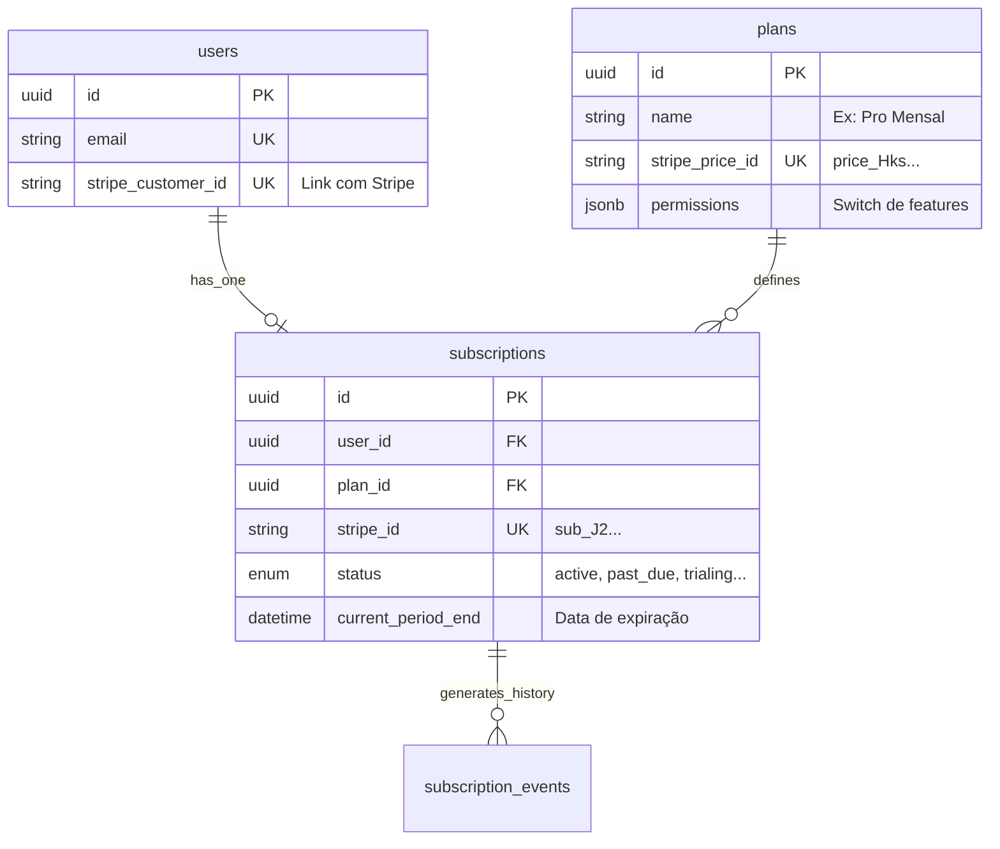

# Modelagem de Assinaturas e Planos (SaaS V1.0)

Este documento define a estrutura de dados para o sistema de cobrança e controle de acesso (RBAC), utilizando o **Stripe** como fonte da verdade (Source of Truth) e o **PostgreSQL** como espelho local para performance.

## 1. Diagrama ER (Entidade-Relacionamento)



## 2. DDL (Definição das Tabelas)

### 2.1 Tabela `plans` (Catálogo de Produtos)
Define o que o usuário está comprando e quais poderes ele ganha.

```sql
CREATE TABLE plans (
    id UUID PRIMARY KEY DEFAULT uuid_generate_v4(),
    name VARCHAR(255) NOT NULL,
    key VARCHAR(50) UNIQUE NOT NULL, -- Ex: 'pro_monthly', 'agency_yearly'
    
    -- Stripe Mapping
    stripe_product_id VARCHAR(255) NOT NULL,
    stripe_price_id VARCHAR(255) NOT NULL,
    
    -- Permissions & Limits (JSONB para flexibilidade)
    -- Ex: { "max_searches": 1000, "can_export": true, "vip_support": false }
    features JSONB NOT NULL DEFAULT '{}',
    
    is_active BOOLEAN DEFAULT true,
    created_at TIMESTAMPTZ DEFAULT NOW()
);
```

### 2.2 Tabela `subscriptions` (O Contrato)
O elo entre o usuário e o plano. **Regra:** Um usuário só tem UM registro ativo nesta tabela por vez.

```sql
CREATE TABLE subscriptions (
    id UUID PRIMARY KEY DEFAULT uuid_generate_v4(),
    user_id UUID NOT NULL REFERENCES users(id),
    plan_id UUID NOT NULL REFERENCES plans(id),
    
    -- Stripe Data
    stripe_subscription_id VARCHAR(255) UNIQUE NOT NULL,
    stripe_customer_id VARCHAR(255) NOT NULL,
    
    -- Lifecycle State
    status VARCHAR(50) NOT NULL, 
    -- Values: 'trialing', 'active', 'past_due' (pagamento falhou), 
    -- 'canceled', 'incomplete', 'incomplete_expired'
    
    current_period_start TIMESTAMPTZ NOT NULL,
    current_period_end TIMESTAMPTZ NOT NULL, -- Fundamental para check de acesso
    cancel_at_period_end BOOLEAN DEFAULT false, -- Se true, acesso continua até o fim do período
    
    created_at TIMESTAMPTZ DEFAULT NOW(),
    updated_at TIMESTAMPTZ DEFAULT NOW()
);

-- Index para query rápida de login: "Este usuário tem acesso?"
CREATE INDEX idx_subs_user_status ON subscriptions(user_id, status);
```

### 2.3 Tabela `subscription_events` (Auditoria)
Log imutável de tudo que acontece com a assinatura (Webhooks).

```sql
CREATE TABLE subscription_events (
    id UUID PRIMARY KEY DEFAULT uuid_generate_v4(),
    subscription_id UUID REFERENCES subscriptions(id),
    
    stripe_event_id VARCHAR(255) UNIQUE, -- Evitar processamento duplicado
    event_type VARCHAR(100) NOT NULL, -- Ex: 'invoice.payment_succeeded', 'customer.subscription.deleted'
    status_captured VARCHAR(50), -- O status da sub naquele momento
    
    payload JSONB, -- O JSON cru do webhook (para debug)
    processed_at TIMESTAMPTZ DEFAULT NOW()
);
```

### 2.4 Alterações na Tabela `users`
Precisamos linkar o usuário ao cliente do Stripe.

```sql
ALTER TABLE users ADD COLUMN stripe_customer_id VARCHAR(255) UNIQUE;
CREATE INDEX idx_users_stripe_cust ON users(stripe_customer_id);
```

## 3. Máquina de Estados (Lifecycle)

A lógica de verificação de acesso (`has_access`) deve seguir esta regra:

1. **Active / Trialing:** ✅ Acesso Liberado.
2. **Past Due:** ⚠️ Acesso Liberado (Grace Period de X dias) ou Bloqueado (decisão de negócio). Sugestão: Liberado por 3 dias, avisando o usuário.
3. **Canceled:** 🛑 Acesso Bloqueado imediatamente APÓS `current_period_end`.
   - *Nota:* Se o usuário cancela hoje, mas pagou até dia 30, o status no Stripe continua `active` até dia 30, e `cancel_at_period_end` fica `true`. O backend deve confiar no `current_period_end`.
4. **Incomplete:** 🛑 Acesso Bloqueado (Pagamento inicial falhou).
