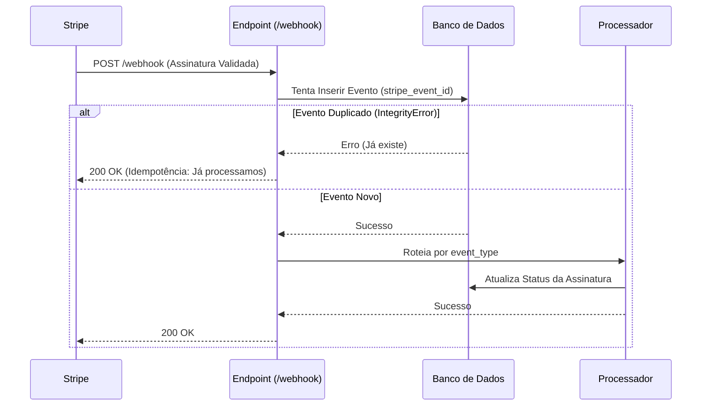

# Arquitetura de Webhooks Stripe (Idempotência e Segurança)

## 1. Fluxo de Eventos (Event Pipeline)

O sistema segue o padrão **Store-First**, onde o evento é persistido antes de qualquer lógica de negócio. Isso garante auditabilidade e previne perda de dados.



## 2. Estratégia Anti-Replay (Segurança)

### A. Validação de Assinatura
Cada request do Stripe contém o header `Stripe-Signature` com um timestamp e um hash HMAC SHA256.
`stripe.Webhook.construct_event(...)` valida:
1. Se a chave secreta (`WEBHOOK_SECRET`) gerou o hash.
2. Se o timestamp é recente (prevenção contra **Replay Attacks** onde um atacante reenvia um pacote antigo capturado).

### B. Idempotência por ID
O Stripe garante que reenvia o mesmo evento (mesmo `evt_...`) se não receber um 200 OK em 5 segundos.
**Nossa Defesa:** O campo `stripe_event_id` na tabela `subscription_events` possui uma constraint `UNIQUE`.
Tentativas de reprocessar o mesmo ID lançam uma exceção de banco de dados, que capturamos para retornar "200 OK" imediatamente, parando o processamento duplicado.

## 3. Máquina de Estados (Assinatura)

O status da assinatura no banco (`subscriptions.status`) reage aos seguintes eventos:

| Evento Stripe | Novo Status Local | Significado | Ação do Sistema |
| :--- | :--- | :--- | :--- |
| `checkout.session.completed` | **Active** | Compra realizada | Liberar acesso, criar registro na tabela `subscriptions`. |
| `invoice.paid`* | **Active** | Renovação mensal paga | Estender `current_period_end` por +1 mês (ou ano). |
| `invoice.payment_failed` | **Past Due** | Cartão recusado | Manter acesso (Grace Period) ou bloquear. Enviar email de "Atualize seu cartão". |
| `customer.subscription.updated` | **(Variável)** | Mudança de plano ou data | Atualizar `plan_id`, `status` e datas. Se `cancel_at_period_end=true`, mostrar aviso no front. |
| `customer.subscription.deleted` | **Canceled** | Cancelou ou expirou | **BLOQUEAR ACESSO IMEDIATO**. |

*\*Nota: `invoice.paid` ocorre tanto na primeira compra quanto nas renovações. Usar este evento para estender a data de validade é a prática recomendada.*

## 4. Pseudocódigo do Handler Robusto

```python
try:
    # 1. Verificar Assinatura
    event = stripe.Webhook.construct_event(payload, sig_header, secret)
    
    # 2. Verificar Idempotência (Store First)
    log = SubscriptionEvent(id=event.id, ...)
    db.add(log)
    db.commit() # Se falhar aqui, é duplicado -> Return 200

except SignatureError:
    return 400 # Ataque
except IntegrityError:
    return 200 # Já processado (Idempotente)
except Exception:
    return 500 # Erro real, Stripe deve tentar de novo

# 3. Processar Lógica
if event.type == 'invoice.paid':
    update_subscription_validity(...)
```
